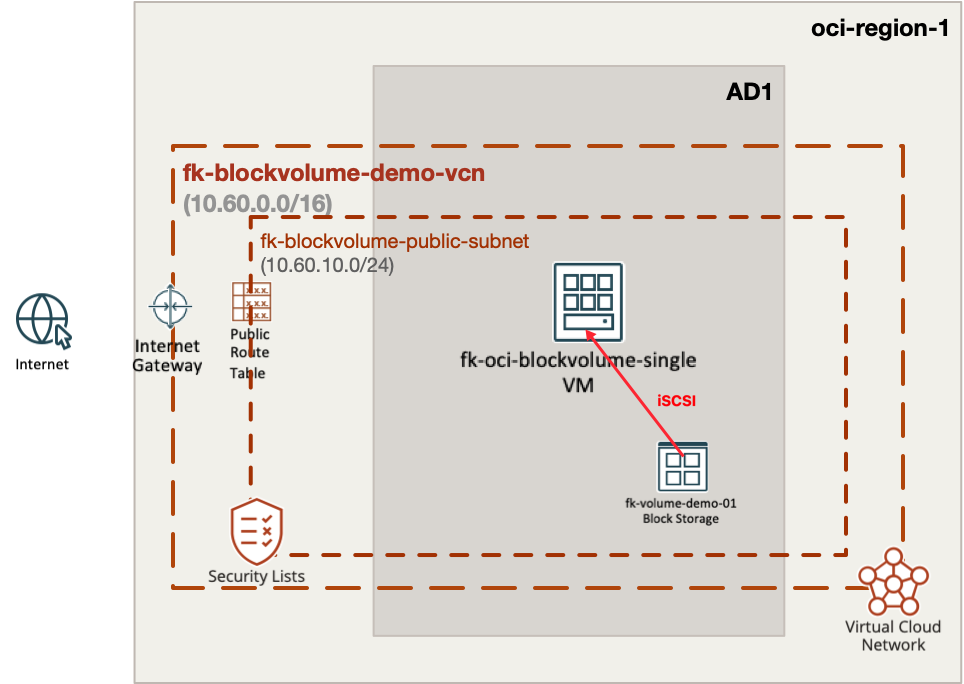
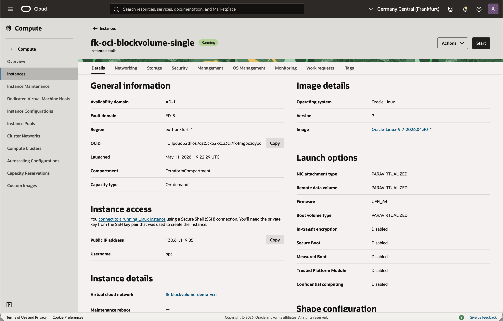
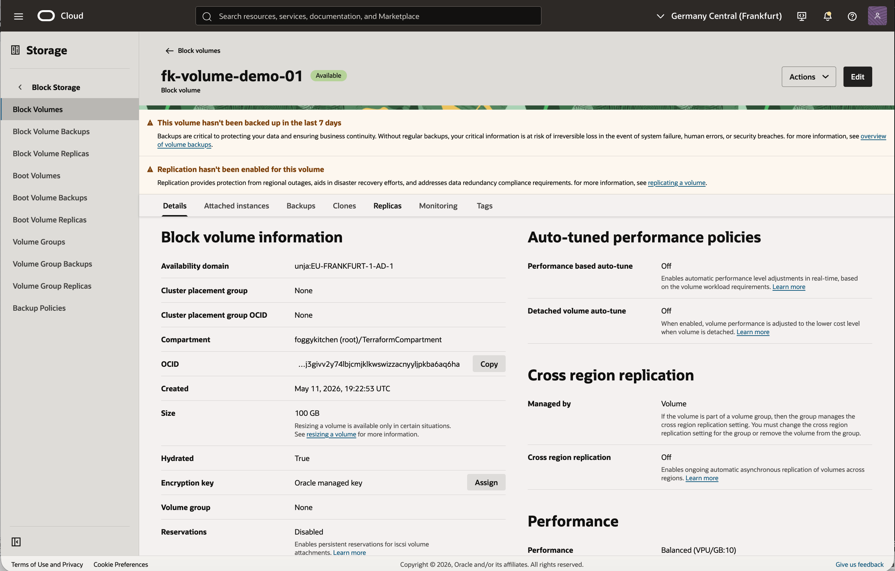
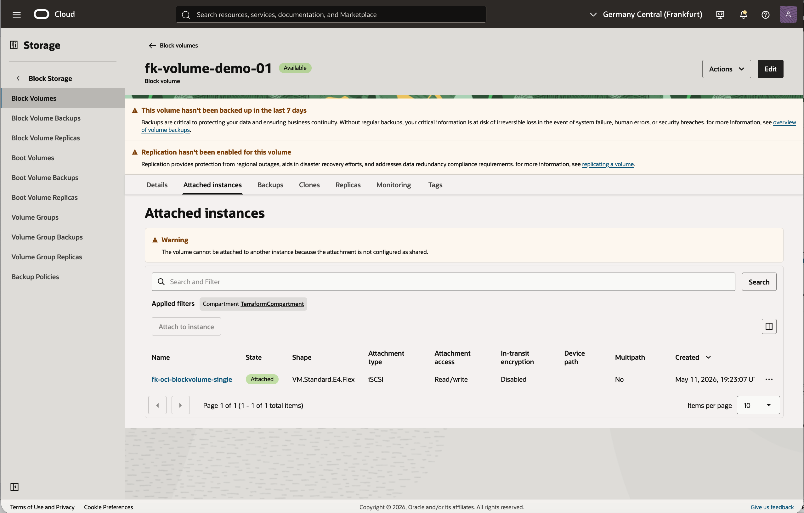

# Example 01: Single Instance with Single Block Volume

This example deploys the smallest practical **OCI Block Volume** setup
using **Terraform/OpenTofu**: one VCN, one compute instance, one block
volume, and one explicit attachment.

The goal is to show the most direct consumption pattern for this module
without mixing in instance pools, autoscaling, or multi-volume layouts.

---

## Architecture Overview



This deployment creates:

- one dedicated **VCN**
- one **public subnet**
- one **OCI Compute Instance**
- one **OCI Block Volume**
- one explicit **volume attachment**
- one **cloud-init bootstrap** that prepares and mounts the data disk inside the guest OS

---

## Deployment Steps

Initialize and apply the Terraform/OpenTofu configuration:

```bash
cp terraform.tfvars.example terraform.tfvars
tofu init
tofu plan
tofu apply
```

If you prefer Terraform:

```bash
terraform init
terraform plan
terraform apply
```

After a successful deployment, Terraform will output:

- the compute instance ID
- the private and public IP
- the block volume ID
- the block volume size
- the resolved attachment device metadata
- a generated SSH private key marked as sensitive

The example also injects a **cloud-init** payload into the compute
instance. That payload waits for the attached data volume, creates a GPT
partition table, formats the first non-root disk as `ext4`, and mounts
it persistently under `/u01`.

The example also generates a temporary **RSA 4096** SSH key pair with
the `tls` provider and injects the public key into the instance, so you
can log in immediately after deployment.

---

## OCI Console Verification

### Instance Status



This view confirms that the example created the expected compute
instance `fk-oci-blockvolume-single`, that it is running in the target
availability domain, and that it received a public IP address on the
public subnet.

### Block Volume



This view confirms that the Block Volume `fk-volume-demo-01` exists,
is available in the same availability domain as the instance, and was
created with the expected size and balanced performance tier.

### Volume Attachment



This view confirms that the Block Volume is attached to the instance
through an explicit **iSCSI** attachment, which matches the module's
default attachment behavior in this example.

---

## Runtime Verification

After `tofu apply`, you can extract the generated SSH key from the
example output and connect directly to the instance:

```bash
tofu output -raw ssh_private_key_pem > id_rsa_fk
chmod 600 id_rsa_fk
ssh -i id_rsa_fk opc@$(tofu output -raw instance_public_ip)
```

Once connected, verify that the Block Volume was discovered, formatted,
 and mounted under `/u01`:

```bash
lsblk -f
mount | grep u01
df -h | grep u01
tail -n 5 /etc/fstab
sudo cat /var/log/fk-mount-block-volume.log
sudo cloud-init status --long
```

Expected results from the validated example run:

- `lsblk -f` shows `/dev/sdb1` as `ext4` with label `u01`
- `mount` shows `/dev/sdb1 on /u01`
- `df -h` shows roughly `98G` mounted on `/u01`
- `/etc/fstab` contains a persistent `UUID=... /u01 ext4 defaults,noatime,_netdev,nofail 0 2` entry
- `/var/log/fk-mount-block-volume.log` shows successful iSCSI login, partitioning, formatting, and mount steps
- `cloud-init status --long` returns `status: done` and no errors

Example verification output from the successful test:

```text
$ lsblk -f
sdb
└─sdb1 ext4 1.0 u01 341fe5b4-bea3-4b68-9a29-de8235c3f4fe /u01

$ mount | grep u01
/dev/sdb1 on /u01 type ext4 (rw,noatime,seclabel,stripe=256,_netdev)

$ df -h | grep u01
/dev/sdb1 98G 24K 93G 1% /u01

$ tail -n 5 /etc/fstab
UUID=341fe5b4-bea3-4b68-9a29-de8235c3f4fe /u01 ext4 defaults,noatime,_netdev,nofail 0 2

$ sudo cloud-init status --long
status: done
errors: []
```

This confirms that the example handles the full guest-side lifecycle:
iSCSI target discovery, login, partitioning, `ext4` filesystem
creation, persistent `fstab` entry, and final mount under `/u01`.

---

## What This Example Demonstrates

- how to create one OCI Block Volume with this module
- how to attach it explicitly to a single compute instance
- how to avoid post-apply `remote-exec` by preparing the disk from inside the guest OS
- how to use cloud-init to prepare and mount the attached disk in the guest OS
- how to combine the module with `terraform-oci-fk-vcn`
- how to combine the module with `terraform-oci-fk-compute`

---

## Cleanup

To remove all resources created by this example:

```bash
tofu destroy
```

Or with Terraform:

```bash
terraform destroy
```

---

## License

Licensed under the **Universal Permissive License (UPL), Version 1.0**.
See [LICENSE](../../LICENSE) for more details.
