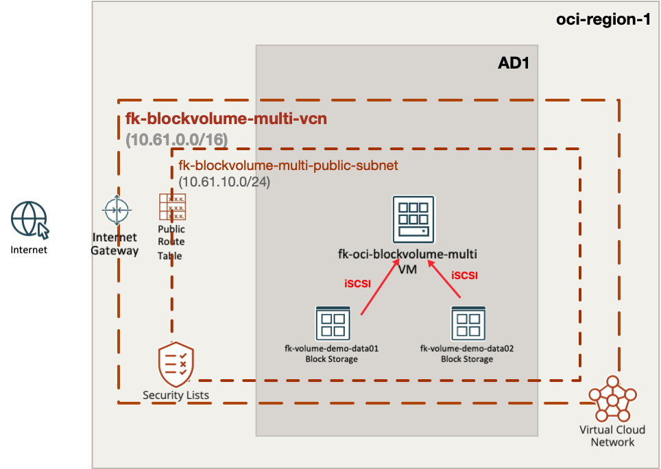
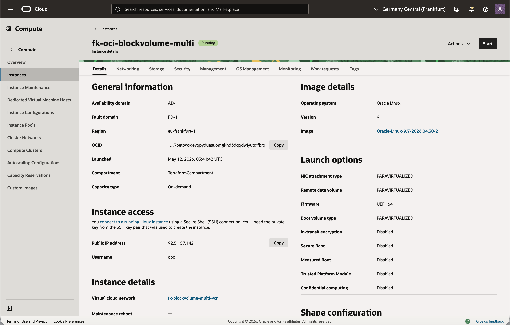
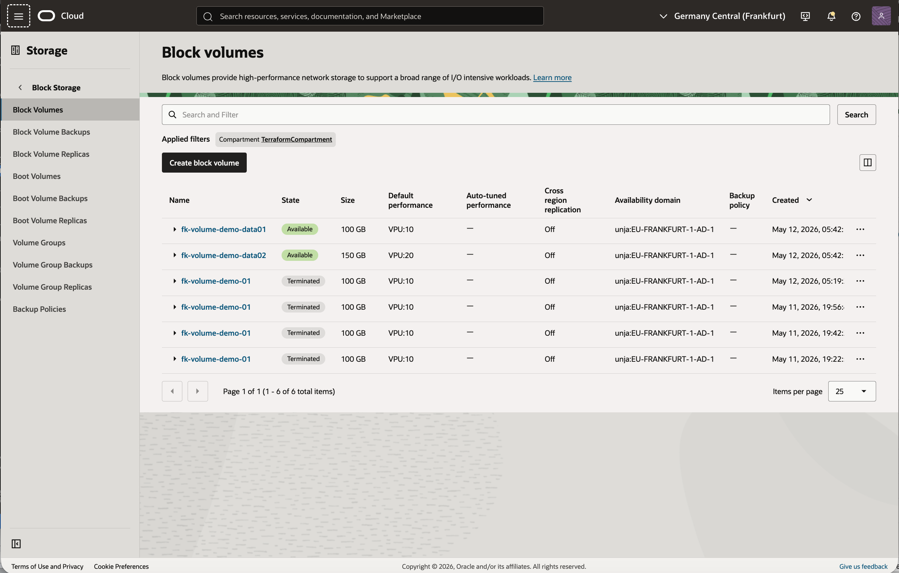
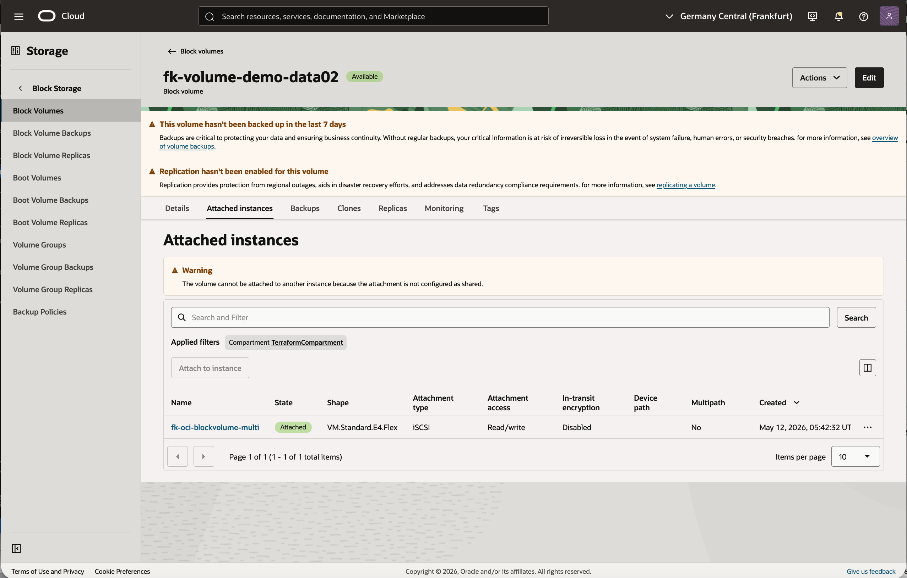

# Example 02: Single Instance with Multiple Block Volumes

This example extends the first pattern into a **map-driven multi-volume
deployment**: one VCN, one compute instance, multiple block volumes, and
multiple explicit attachments created with `for_each`.

The goal is to show how the module scales cleanly when a single workload
needs more than one persistent data volume.

---

## Architecture Overview



This deployment creates:

- one dedicated **VCN**
- one **public subnet**
- one **OCI Compute Instance**
- multiple **OCI Block Volumes**
- one explicit **attachment per volume**
- one **cloud-init bootstrap** that prepares and mounts multiple data disks inside the guest OS

---

## Deployment Steps

Initialize and apply the Terraform/OpenTofu configuration:

```bash
cp terraform.tfvars.example terraform.tfvars
tofu init
tofu plan
tofu apply
```

If you prefer Terraform:

```bash
terraform init
terraform plan
terraform apply
```

After a successful deployment, Terraform will output:

- the compute instance ID
- the private and public IP
- a map of block volume IDs
- a map of block volume sizes
- a generated SSH private key marked as sensitive

The example generates a temporary **RSA 4096** SSH key pair with the
`tls` provider and injects the public key into the compute instance so
the host is immediately reachable after deployment.

The example also injects a **cloud-init** payload into the compute
instance. That payload performs iSCSI discovery and login, then
partitions, formats, and mounts each expected data disk under a
dedicated mountpoint.

---

## OCI Console Verification

### Instance Status



This view confirms that the example created the expected compute
instance `fk-oci-blockvolume-multi`, that it is running in the selected
availability domain, and that it received a public IP address on the
public subnet.

### Block Volumes



This view confirms that both Block Volumes were created successfully:
`fk-volume-demo-data01` with `100 GB` at `VPU:10`, and
`fk-volume-demo-data02` with `150 GB` at `VPU:20`.

### Volume Attachment `data01`


This view confirms that the first Block Volume is attached to the
instance through an explicit **iSCSI** attachment.

### Volume Attachment `data02`



This view confirms that the second Block Volume is also attached to the
same compute instance through its own **iSCSI** attachment.

---

## Runtime Verification

After `tofu apply`, you can extract the generated SSH key from the
example output and connect directly to the instance:

```bash
tofu output -raw ssh_private_key_pem > id_rsa_fk
chmod 600 id_rsa_fk
ssh -i id_rsa_fk opc@$(tofu output -raw instance_public_ip)
```

Once connected, verify that both attached Block Volumes were
discovered, formatted, and mounted under `/u01` and `/u02`:

```bash
lsblk -f
mount | grep -E 'u01|u02'
df -h | grep -E 'u01|u02'
tail -n 8 /etc/fstab
sudo cat /var/log/fk-mount-multi-block-volumes.log
sudo cloud-init status --long
```

Expected results from the validated example run:

- `lsblk -f` shows one `ext4` filesystem with label `u01` mounted on `/u01`
- `lsblk -f` shows one `ext4` filesystem with label `u02` mounted on `/u02`
- `mount` shows two data-volume mounts, one for `/u01` and one for `/u02`
- `df -h` shows roughly `98G` mounted on `/u01` and `147G` on `/u02`
- `/etc/fstab` contains persistent `UUID=... /u01 ...` and `UUID=... /u02 ...` entries
- `/var/log/fk-mount-multi-block-volumes.log` shows successful iSCSI login, partitioning, formatting, and mount steps for both disks
- `cloud-init status --long` returns `status: done` and no errors

OCI does not guarantee stable Linux device names for attached iSCSI
volumes, so the `u01` and `u02` filesystems may appear as `/dev/sdb1`
and `/dev/sdc1` in either order. The stable references are the
filesystem labels, UUIDs, and final mountpoints.

Example verification output from the successful test:

```text
$ lsblk -f
sdb
└─sdb1 ext4 1.0 u02 a04c5bfb-c95d-48cb-8e6f-a38166dc9093 /u02
sdc
└─sdc1 ext4 1.0 u01 935963da-22cd-4256-89be-0a0174ddb9c9 /u01

$ mount | grep -E 'u01|u02'
/dev/sdc1 on /u01 type ext4 (rw,noatime,seclabel,stripe=256,_netdev)
/dev/sdb1 on /u02 type ext4 (rw,noatime,seclabel,stripe=256,_netdev)

$ df -h | grep -E 'u01|u02'
/dev/sdc1 98G 24K 93G 1% /u01
/dev/sdb1 147G 28K 140G 1% /u02

$ tail -n 8 /etc/fstab
UUID=935963da-22cd-4256-89be-0a0174ddb9c9 /u01 ext4 defaults,noatime,_netdev,nofail 0 2
UUID=a04c5bfb-c95d-48cb-8e6f-a38166dc9093 /u02 ext4 defaults,noatime,_netdev,nofail 0 2

$ sudo cloud-init status --long
status: done
errors: []
```

This confirms that the example handles the full guest-side lifecycle for
multiple data disks: iSCSI target discovery, login, partitioning,
`ext4` filesystem creation, persistent `fstab` entries, and final mounts
under `/u01` and `/u02`.

---

## What This Example Demonstrates

- how to create multiple OCI Block Volumes with `for_each`
- how to attach multiple volumes to one compute instance
- how to bootstrap multiple iSCSI-attached data disks from cloud-init
- how to keep storage definitions explicit with a map input
- how to reuse the same network and compute building blocks from example 01

---

## Cleanup

To remove all resources created by this example:

```bash
tofu destroy
```

Or with Terraform:

```bash
terraform destroy
```

---

## License

Licensed under the **Universal Permissive License (UPL), Version 1.0**.
See [LICENSE](../../LICENSE) for more details.
